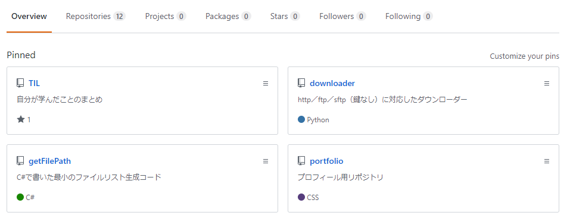

## 概要

「CSS フレームワーク（以下 CSSFW）」とは何か、また CSSFW の主要なフレームワークを知る  
概念を理解することで開発技術を上げるだけでなくコンポーネント概念を理解する

## CSSFW とは

WEB ページを構築する際に同じデザインパーツが頻出することがある  
また独自デザインではなく広く配布されたデザインでもよい場合がある  
同じデザインパターンを使い回す仕組み・テンプレートを CSSFW と呼ぶ  
※案件等で独自コンポーネントを作成することもあるが、ここでは公開されているものを説明していく

基本的にはテンプレートファイルを読み込み、デザインを反映したい要素へ class を当てて使用する  
input タグ等個別のタグへ当てる class から、ページ全体の Layout クラスまで用意されており  
CSSFW を読み込むことで 1 ページを全て組める

## 使用するうえでのメリット／デメリット

CSSFW を使うことによるメリット・デメリットは存在する  
メリデメに加えて「使用した方がよい場面」「使用しない方がよい場面」を記載する

### メリット

CSSFW のテンプレートを使用することでデザイン開発工数を削減できる  
本来力をいれたいシステムのコーディングに集中できる  
予め用意されたパーツを使うことでデザインの破綻や差異を吸収することができる

### デメリット

広く使われている CSSFW を使うことで他サイトと似たデザインになる  
またグラフィック色が強いデザインをコーディングする場合は、自由度が低い CSSFW だと使用が難しい  
サイトのサービスによって利益を得る場合、商用利用が可能かどうかも確認する必要がある  
デザインのパターンが全て記載された CSS ファイルを読み込むため、ファイルサイズが大きくなりやすい

### 使用場面

使用した方がよい場面：  
システムをメインに開発したい個人開発・モックアップ

使用しない方がよい場面：  
LP、企業のサイト（商用利用可の CSSFW であれば問題ない）

## 主要な CSSFW

2020 年現在多くの CSSFW が存在するが、その中で「有名なもの」「モダンなもの」「軽量なもの」からそれぞれ 1 つずつ紹介する

- Bootstrap
- Bulma
- Pure

### Bootstrap

[公式サイト](https://getbootstrap.jp/)

世界で有名なフレームワーク、Twitter 社が開発したものが元になっている。CSS だけでなく、jQuery も付随しているためファイルサイズが大きい／DOM 操作がし辛いなど問題がある（Bootstrap 5 で jQuery の切り離しを発表している）

MIT ライセンス

> 世界で最も人気のあるフロントエンドのコンポーネントライブラリ。レスポンシブウェブデザインでモバイルファーストを実現しています。
>
> Bootstrap は HTML, CSS そして JavaScript で構成されたオープンソースのツールキットです。Sass の変数とミックスイン, レスポンシブなグリッドシステム, 豊富なコンポーネント, jQuery ベースのパワフルなプラグインで, あなたのアイデアを素早く形にします。

### Bulma

[公式サイト](https://bulma.io/)

モダン
CDN/SASS のどちらでも使用できる。フレームワークは CSS のみなど、Bootstrap に対して進化させたようなフレームワーク

MIT ライセンス

> Bulma is a free, open source CSS framework based on Flexbox and used by more than 200,000 developers.

### Pure

[公式サイト](https://purecss.io/)

アメリカ Yahoo!社が開発した CSSFW。軽量で CSS 共通の問題である「使用しないスタイルまで含まれているのでファイルが重くなる」問題に対して「FW として最低限のみに対応し個別スタイルは使用者が書く」方針で作成されている。npm 等各種パッケージに対応

Yahoo! Inc. BSD ライセンス

> A set of small, responsive CSS modules that you can use in every web project.

## 実習

自分で CSSFW を 1 つ選択し、添付画像を実装してください

文字コード等の細かな規約・ディレクトリ構成指示は設けません。自身で統一してください  
デザインの差異は確認しません。機能の実装も不要です  
選択した CSSFW のテンプレートを用いた大体の再現で十分ですが、動的に書き換えることを意識してください

## よくある指摘に対して

「案件としてコーディングする場合に CSSFW を使用することはないため企業の学習としては不要」  
という考え方が存在する  
たしかに企業案件では企業の独自デザインを使用することが多く CSSFW を使用することはあまりない

しかし中～大規模のサイトでは大抵、コンポーネントリストなど同じ概念・仕組みを利用する場合は多々ある  
また WEB サイトを新規構築する際に「破綻しない CSS」を書くときに悩むことがある  
上記の場合に「コンポーネントリストはどう使えばよいか」「どうすれば破綻しにくい CSS を書けるか」を CSSFW から読み解くことができる  
案件のコンポーネントリスト・手癖のコーディングしか知らないと WEB 業界でのスタンダードを知らずに古い知識で止まってしまう恐れがある

CSSFW は「大多数の人間が使用しておりアップデートされている生きている教材」として大きな価値がある
